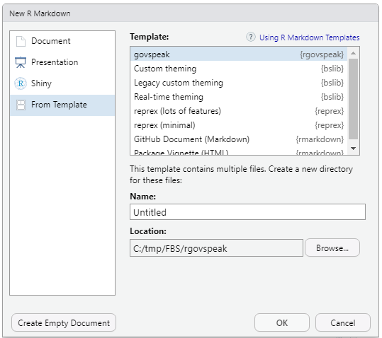

# 👀 What is rgovspeak?

**rgovspeak** is an r package that allows govspeak markdown to be used in rmarkdown documents.

**rgovspeak integrates natively with rmarkdown** allowing the use of govspeak markdown in your reproducible analytical pipeline (rap). 
It provides a new output format for rmarkdown documents producing a whitehall publisher compatible markdown file and a html preview
showing what the document will look like when published on gov.uk.

🎉 **Version 0.3 out now!** [Check out the release notes here](https://github.com/Defra-Data-Science-Centre-of-Excellence/rgovspeak/releases/tag/v0.3).

<br>

# 🤖 Why use rgovspeak?

rgovspeak is designed to be used to generate single page documents suitable for publication on gov.uk. It allows R users to integrate the publishing step into their RAP's. Users can integrate rgovspeak into their existing piplines to easily move over to the production of html reports and documents. By using rgovspeak in your project, you get the following benefits:

- **Reproducibility** of document generation.
- A **simple and clear** way to preview how your document will look on gov.uk.
- **Plug-and-play integrations**: add the final step to your rap and get your work published.
- A standalone html document that can be passed around your team for easy review, no other files needed.
- Painless creation of a whitehall publisher compatible markdown and image files.
- Save time and money for you and your publishing team.

# 🎮 Features

### 1. 🗃 a new govspeak document output type
 
Simply add the following header to your Rmd doc

    ---
    title: "rgovspeak doc"
    date: "`r format(Sys.time(), '%d %B %Y')`"
    output: rgovspeak::govspeak
    ---

### 2. ♻️ fully govspeak compatible

All of the markup listed in the govspeak [guide](https://govspeak-preview.herokuapp.com/guide) is implemented. You can use it directly in
your document.

### 3. 📊 Visualize Statistics

Use R blocks as you would with any rmarkdown document. Image files for plots are automatically created at the correct size and resolution
for publication on gov.uk.

### 4. 🧐 Preview your document

Once you've written your document, you need a way of seeing what was produced and how it will look. rgovspeak offers a html preview allowing you to see how your document will look and behave on gov.uk.

### 5. 🛠 Publication documents auto generated

No need to learn whitehall publisher rgovspeak generates compatible files so you don't need to worry about it. Save yourself and your publishing team time by reducing the amount of review work needed to get published.

# 🤸 Getting Started

## 💾 Install rgovspeak

Download the latest [release](https://github.com/Defra-Data-Science-Centre-of-Excellence/rgovspeak/releases/tag/v0.3) and install
the package in r.

```r
install.packages("~/Downloads/rgovspeak_0.3.0.zip", repos=NULL)
```

#### Step 2: write your markdown document
If you are using Rstudio you can select File -> New File -> R Markdown... then select from template in the popup and then find govspeak in 
the list.



This will create a folder where all the outputs will be store with the skeleton teplate document.

This shows all the govspeak tags and how to use them. When your ready simply replace the text with your own.

You can also create a new rmarkdown file and add the govespeak header.

    ---
    title: "rgovspeak doc"
    date: "`r format(Sys.time(), '%d %B %Y')`"
    output: rgovspeak::govspeak
    ---

This wont create a directory to store everything in any generated files will be in the current working directory.

When your happy with your document press the knit button. This will render an html preview for you, there will be a markdown document with

a _govspeak.md prefix and any images will be in the images folder. The file images.csv shows which images were mapped to each govspeak image tag.

These assets can then be uploaded to whitehall publisher or sent to a publication team for upload.
