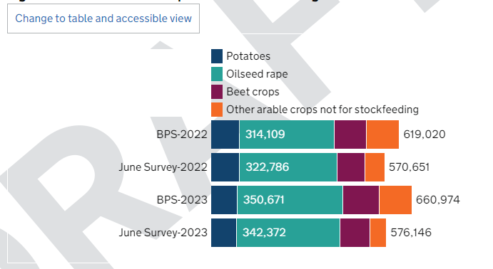

# 👀 What is rgovspeak?

**rgovspeak** is an r package that allows govspeak markdown to be used in rmarkdown documents.

**rgovspeak integrates natively with rmarkdown** allowing the use of govspeak markdown in your reproducible analytical pipeline (rap). 
It provides a new output format for rmarkdown documents producing a whitehall publisher compatible markdown file and a html preview
showing what the document will look like when published on gov.uk.

🎉 **Version 1.0 out now!** [Check out the release notes here](https://github.com/Defra-Data-Science-Centre-of-Excellence/rgovspeak/releases/tag/v1.0).

This version of `rgovspeak` is a complete rewrite of the package. It now behaves like a standard RMarkdown template. 

**Important**: Documents created with earlier versions will not be compatible and will require modification.

<br>

# 🤖 Why use rgovspeak?

rgovspeak is designed to be used to generate single page documents suitable for publication on gov.uk. It allows R users to integrate the publishing step into their RAP's. Users can integrate rgovspeak into their existing piplines to easily move over to the production of html reports and documents. By using rgovspeak in your project, you get the following benefits:

- **Reproducibility** of document generation.
- A **simple and clear** way to preview how your document will look on gov.uk.
- **Plug-and-play integrations**: add the final step to your rap and get your work published.
- A standalone html document that can be passed around your team for easy review, no other files needed.
- Painless creation of a whitehall publisher compatible markdown and image files.
- Save time and money for you and your publishing team.

# 🎮 Features

### 1. 🗃 a new govspeak document output type
 
Simply add the following header to your Rmd doc

    ---
    title: My rgovspeak document
    output: rgovspeak::govspeak
    ---

### 2. ♻️ fully govspeak compatible

All of the markup listed in the govspeak [guide](https://govspeak-preview.publishing.service.gov.uk/guide) is implemented. You can use it directly in your document.

### 3. 📊 Visualize Statistics

Use R blocks as you would with any rmarkdown document. Image files for plots are automatically created at the correct size and resolution
for publication on gov.uk.

### 4. 🧐 Preview your document

Once you've written your document, you need a way of seeing what was produced and how it will look. rgovspeak offers a html preview allowing you to see how your document will look and behave on gov.uk.

### 5. 🛠 Publication documents auto generated

No need to learn whitehall publisher rgovspeak generates compatible files so you don't need to worry about it. Save yourself and your publishing team time by reducing the amount of review work needed to get published.

# 🤸 Getting Started

## 💾 Install rgovspeak

Download the latest [release](https://github.com/Defra-Data-Science-Centre-of-Excellence/rgovspeak/releases/tag/v0.3) and install
the package in r.

```r
install.packages("~/Downloads/rgovspeak_1.0.zip", repos=NULL)
```

## YAML Header Configuration

The YAML header in`rgovspeak` is similar to any RMarkdown document. The primary difference lies in specifying the output format.

### Basic Output Format
To render the document as a govspeak document, set the output format to `rgovspeak::govspeak`:

    ---
    output: rgovspeak::govspeak
    ---

### Multiple Output Formats

You can specify additional output formats (e.g., word_document) alongside `rgovspeak`:


    ---
    output: 
      rgovspeak::govspeak: default
      word_document: default
    ---

**Note**: When specifying multiple formats, you must provide options or use `default`. You will also need to render using `rmardown::render` 
to generate the additional formats as the knit button will only render the 1st output.

### Output Options

You can pass various options to customise the govspeak output. For example, to use multiple image formats and custom image dimensions:

    ---
    output: 
      rgovspeak::govspeak: 
        image_type: ['png', 'jpeg', 'pdf', 'svg', 'tiff']
        fig_height: 5.5
        fig_width: 8
      word_document: default
    ---

This configuration will render images in all specified formats and override the default image size.

**Note**: The default image format is now `svg`.

#### Typical YAML Header Example 

    ---
    title: "Agricultural Price Index"
    output: 
      rgovspeak::govspeak: default
      word_document:
        fig_height: 5.5
        fig_width: 8
    ---

This setup produces an HTML version with the default SVG image format and a Word document with resized images for better appearance. 
This dual-output is useful for quality control and text editing.

### Other setup

`rgovspeak` is designed to render your document in a way that is compatible with Whitehall Publisher and the expectations of the publishing team. 
Certain naming conventions are required for files to be accepted for publishing. `rgovspeak` will automatically save files under its control with 
the correct names.

To do this, it needs to know the publishing date of the document. This can be set in the YAML header or as a parameter. If set as a parameter, 
it will take precedence over the YAML header.

In your code, you can do:

```{r}
  rgovspeak::set_publication_date(as.Date("2024-7-11"))
```

This is useful if you are calling 

```{r, eval=FALSE}
  rmarkdown::render("path/to/your/file.Rmd")
```

from your script.

If you want to set it in your YAML header use publish_date:

    ---
    title: "Agricultural Price Index"
    publish_date: '`r as.Date("2024-04-25")`'
    output: 
      rgovspeak::govspeak: default
      word_document:
        fig_height: 5.5
        fig_width: 8
    ---

Now when files are created during render they will be saved with the correct date in the file name.

**Note**: If you do not set the publishing date using either method the current date will be used by default.

### Auto Barchart

Govspeak provides for the automatic creation of barcharts using the `{barchart}` tag. `rgovspeak` will automatically create the 
barchart for you in the html output. `rgovspeak's` auto charting implementation is not a pixel perfect recreation of what you 
will see on gov.uk, formatting issues with text may be visible. This only affects the html draft the markdown is not affected 
and charts will be created correctly when published.




### Images

`rgovspeak` expects each R chunk to generate a single image. If you have multiple plots in a single chunk, only the last plot will be saved. 
The image name is derived from the R chunk name and the publishing date of the document. So, name your R chunks accordingly, 
e.g., 'iris-figure-1' or 'iris-figure-2'.

The default format is now SVG. Once rendered images will appear in the images folder, with subfolders for each image type.

### Datasets

`rgovspeak` can save datasets for you using the `rgovspeak::save_data` function. 

This function takes two arguments: 

1. the name of the function to save the data (e.g., `write.csv`)
2. a list of arguments to pass to the function (e.g., `list(iris, "iris.csv")`). 

When you render the document, files registered with `rgovspeak` via `rgovspeak::save_data` will be moved to the `data` folder.

To save a CSV file of the iris dataset:

1. write.csv is the function to save the data.
2. list(iris, "iris.csv") are the arguments to pass to the function (the dataset and the file name).

```{r}
rgovspeak::save_data("write.csv", list(iris, "iris.csv"))
```

You can use this function to save any data you need for your document.

For example, to save an Excel file and an ODS file of the iris dataset, ensure the necessary packages (openxlsx and readODS) are installed and loaded:

```{r, eval=requireNamespace("openxlsx", quietly=TRUE) && requireNamespace("readODS", quietly=TRUE)}
library(openxlsx) 
library(readODS)
rgovspeak::save_data("write.xlsx", list(iris, "iris.xlsx"))
rgovspeak::save_data("write_ods", list(iris, "iris.ods"))
```

### Output Structure

You will find the saved files in the `data` folder, organised into subfolders based on the file extension. 
The file names will include the provided name and the publishing date.

You can use the `rgovspeak::save_data` function either within your RMarkdown document or in a separate R script before calling `rmarkdown::render`.

**Note**: This functionality only works when rendering to the govspeak format. If you render to multiple formats, the data will only be moved for the initial render to govspeak.

### Rendering

In previous versions of `rgovspeak`, files were forcefully rendered to a folder named output. The package has since been updated to function 
like a standard R Markdown template. Now, when you render using the knit button, your documents are rendered to the current directory.

To specify a different directory for output, you can use rmarkdown::render and provide the output_dir argument:

```{r, eval=FALSE}
rmarkdown::render("path/to/your/file.Rmd", output_dir = "path/to/output")
```

After rendering, the following files and folders will be created:

1. An HTML file named after your Rmd file, for example, instructions.html.
2. A text file named after your Rmd file and the publishing date, such as instructions_11jul2024.txt.
3. A folder named images with subfolders for each image type, if images were included. `rgovspeak` will handle the creation of the image tags within the markdown,
you do not need to edit the markdown to include the images.
4. A folder named data with subfolders for each data type, if `rgovspeak::save_data` was utilised.

If you specified an output_dir, these files will be created in that directory. Additional files generated from multiple formats will also be placed in the same directory as the govspeak files.